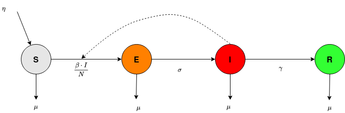
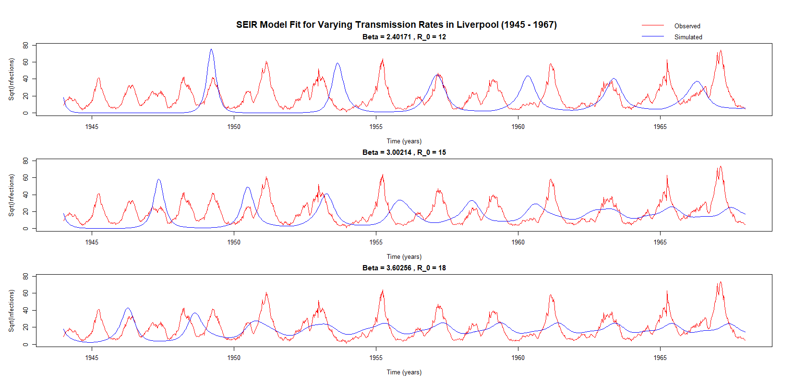

# The Influence of Seasonal Variation by the Mean Transmission Rate on the Pattern and Magnitude of Measles Outbreak in Liverpool Between 1947 and 1967

It is an epidemiology project achieved in context of the [MMED 2024](https://www.ici3d.org/MMED), a 2­‐week modeling clinic that emphasizes the use of data in understanding infectious disease dynamics and modeling. 

## Overview

In this project, we highlight the influence of seasonal variation by the transmission rate on the pattern and magnitude of measles outbreaks in Liverpool between 1947 and 1967. Using the SEIR (Susceptible-Exposed-Infectious-Recovered) model, which includes birth and death rates, along with a sinusoidal function (representing the climatic factors) and step functions (representing the human dynamics) to represent the seasonal transmission rate, we simulate the number of infectious individuals over time given different values of the mean transmission rate (beta) as calculated from the basic reproduction number (R_0).

## Key Features

- **Transmission Rate**: The transmission rate is modeled as a sinusoidal function and step functions whose amplitude and magnitude vary as a function of the mean transmission rate $\beta_0$.

- **SEIR Model Parameters**: The model incorporates birth and death rates to provide a realistic simulation of measles dynamics.

- **Basic Reproduction Number (R_0)**: We explore different values for the basic reproduction number $R_0$ ranging from 12 to 18, and study their impact on the measles outbreak patterns.

## Objectives

- To understand the influence of seasonal variation in the transmission rate on measles outbreak patterns.
- To evaluate how different values of the basic reproduction number $ R_0 $ influence the magnitude and recurrence of outbreaks.

## Methodology

- **SEIR Model**: We use the SEIR model to simulate the dynamics of measles outbreaks. The model equations are extended to include birth and death rates.



- **Mean Transmission Rate**: The mean transmission rate $\beta(t)$ varying with time is modeled as:
  \begin{align}
  \beta(t) = \beta_0 \left(1 + 0.08 \sin(\frac{2\pi t}{365})\right)
  \end{align}
  where $\beta_0$ is the mean transmission rate, $0.08$ is the amplitude, and $\pi$ is the phase.
- **Simulation**: We run simulations for different values of $R_0$ and analyze the resulting outbreak patterns.

## Results

The plots below illustrate the fit of the SEIR model to observed measles case data for different values of the transmission rate parameter $\beta$. Each plot shows both observed (green) and simulated (red and blue) cases over time.

<!--

## Conclusion

The SEIR model with the three(3) varying mean transmission rates(β), which were different due to the different values of reproduction rates, provides insights to the relationship between seasonal changes and the spread of measles in Liverpool between 1947 and 1967. Using the sine wave and the step functions along with the SEIR model effectively captures the patterns of measles outbreaks and shows how targeted interventions can make a difference.
Our key findings include:
- Significant outbreaks are linked to high transmission rates $R_0 = 18$, highlighting the importance of strict public health measures during these times.
- The situation shows that closing schools strategically during humid months can lower the severity of measles outbreaks.
- The sine wave function, used to model seasonal variations, has a crucial impact on infection dynamics and should be included in epidemiological modeling and public health planning.

## Repository Contents

- `src/`: Contains the source code for the SEIR model simulations.
- `data/`: Contains the dataset of measles cases in London from 1944 to 1967.
- `images/`: Contains images of the simulations.
- `mmed_report.pdf`: Contains the results of the simulations, including plots and analysis.

## Usage

- Clone the repository:
   ```bash
   git clone https://github.com//cathyessuman/2CST-MeaslesModel/
